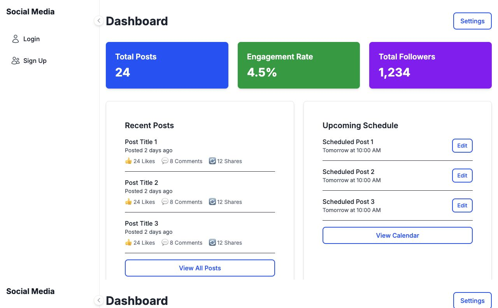
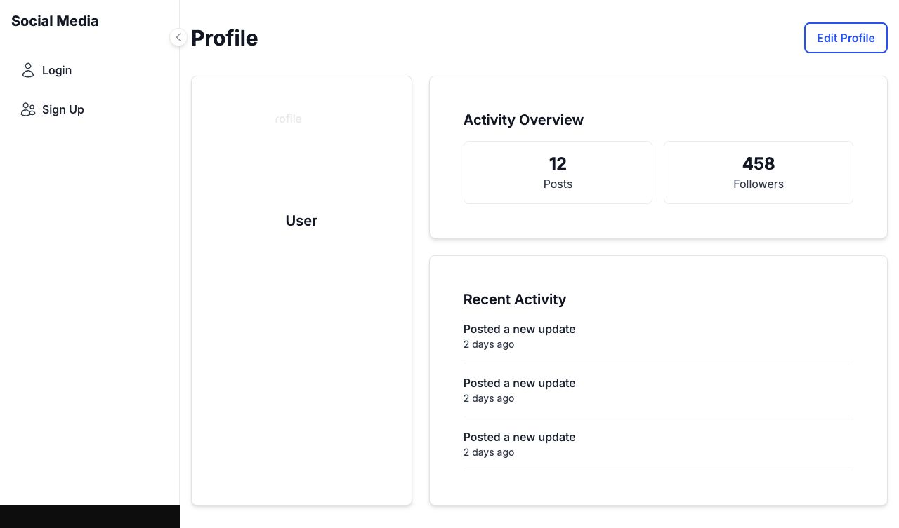

# Nexura

Nexura is a full-stack social media management dashboard built with Next.js, TypeScript, Firebase, and Tailwind CSS. It provides one workspace for account management, publishing workflows, profile management, and social performance monitoring.

[](https://nextjs.org/)
[](https://www.typescriptlang.org/)
[](https://firebase.google.com/)

## Live demo

[Open the deployed application](https://nexura-eight.vercel.app/)

## Screenshots

### Analytics dashboard



### User profile



## What the project demonstrates

- Responsive Next.js App Router architecture
- Firebase Authentication and Firestore integration
- Dashboard metrics, recent-post activity, and scheduling views
- Profile viewing and editing workflows
- LinkedIn, Instagram, and X/Twitter OAuth route integrations
- Server-side API routes for social publishing
- Reusable UI components documented with Storybook
- TypeScript, ESLint, Vitest, and production-build validation

## Technology stack

| Area | Technology |
| --- | --- |
| Web application | Next.js 15, React 19, TypeScript |
| Styling | Tailwind CSS 4 |
| Authentication and data | Firebase Authentication, Firestore, Firebase Storage |
| Social integrations | LinkedIn, Instagram, X/Twitter APIs |
| Component development | Storybook 8 |
| Quality checks | ESLint, TypeScript, Vitest, Playwright |
| Deployment | Vercel |

## Project structure

```text
src/
├── app/                  # Pages and server API routes
│   ├── api/              # OAuth callbacks and publishing endpoints
│   └── dashboard/        # Dashboard, profile, settings, and social pages
├── components/           # Authentication, layout, profile, and UI components
├── contexts/             # Firebase authentication state
├── lib/                  # Firebase client setup
└── stories/              # Storybook component stories
```

## Local setup

### Prerequisites

- Node.js 20 or newer
- npm
- A Firebase project
- Developer credentials for any social platform you want to connect

### Installation

```bash
git clone https://github.com/mouhamed1slem-bouazizi/Nexura.git
cd Nexura
npm ci
cp .env.example .env.local
npm run dev
```

Open [http://localhost:3000](http://localhost:3000).

The public pages and sample dashboard can be reviewed without connecting external social accounts. OAuth and publishing features require valid developer applications and correctly configured callback URLs.

## Environment configuration

Copy `.env.example` to `.env.local` and provide only the credentials needed for the integrations you intend to test. Never commit `.env.local`, private keys, access tokens, or client secrets.

Firebase client configuration is currently defined in `src/lib/firebase.ts`. Firebase Admin and social publishing routes use server-side environment variables.

## Quality checks

```bash
npm run typecheck
npm run lint
npm test
npm run build-storybook
npm run build
```

The Storybook browser tests require a Playwright Chromium installation:

```bash
npx playwright install chromium
```

## Responsible use and limitations

- Social publishing is never automatic without user-approved platform credentials and permissions.
- OAuth applications must use callback URLs that exactly match their provider configuration.
- Platform APIs, scopes, and rate limits can change; integrations should be revalidated before production use.
- The dashboard includes sample portfolio metrics. Production analytics should be populated from authorized platform data.
- Firebase Security Rules should be reviewed and deployed for the intended production access model.

## Portfolio scope

This public repository contains application code and sanitized documentation only. Screenshots use sample data and do not expose client, workplace, or private social-account information.

## License

This project is provided as a portfolio demonstration. Contact the repository owner before commercial reuse.
